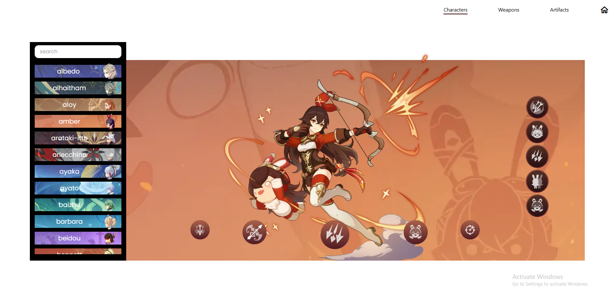
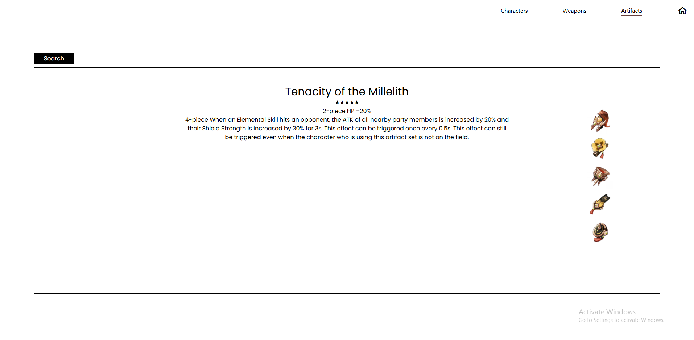
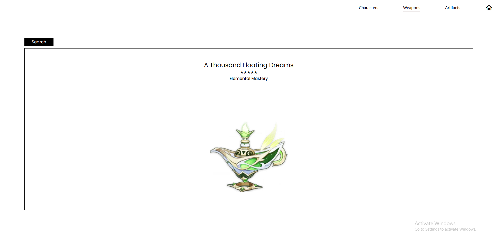

Welcom the Gensheesh an informative genshin impact website

How to install:

1. Download the folder
2. Open in your compiler/code editor
3. In your terminal type npm install
4. Then type npm start 
5. And you are all set, enjoy!

Gallery

